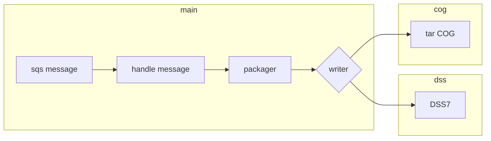

# Dev Notes




## packager message body with download ID

```
{"id" : "a01fdb6e-c496-4ebf-a354-b11b0847523b"}
```

## packager_request endpoint with download ID

`"{CUMULUS_API_URL}/downloads/{download_id}/packager_request"`

```
{
    "download_id": "a01fdb6e-c496-4ebf-a354-b11b0847523b",
    "output_key": "cumulus/download/dss7/download_a01fdb6e-c496-4ebf-a354-b11b0847523b.dss",
    "contents": [
        {
            "bucket": "castle-data-develop",
            "key": "cumulus/products/cbrfc-mpe/xmrg0526202206z.tif",
            "dss_datatype": "PER-CUM",
            "dss_fpart": "CBRFC-MPE",
            "dss_cpart": "PRECIP",
            "dss_dpart": "26MAY2022:0500",
            "dss_epart": "26MAY2022:0600",
            "dss_unit": "MM"
        },
        {
            "bucket": "castle-data-develop",
            "key": "cumulus/products/cbrfc-mpe/xmrg0526202207z.tif",
            "dss_datatype": "PER-CUM",
            "dss_fpart": "CBRFC-MPE",
            "dss_cpart": "PRECIP",
            "dss_dpart": "26MAY2022:0600",
            "dss_epart": "26MAY2022:0700",
            "dss_unit": "MM"
        },
        {
            "bucket": "castle-data-develop",
            "key": "cumulus/products/cbrfc-mpe/xmrg0526202208z.tif",
            "dss_datatype": "PER-CUM",
            "dss_fpart": "CBRFC-MPE",
            "dss_cpart": "PRECIP",
            "dss_dpart": "26MAY2022:0700",
            "dss_epart": "26MAY2022:0800",
            "dss_unit": "MM"
        },
    "format": "dss7",
    "extent": {
        "name": "Ohio River",
        "bbox": [
            488000,
            1344000,
            1380000,
            2102000
        ]
    }
}
```
___

## Create documentation from the Python docstring

_Requires Pycco_

`Example:`

```python
pycco cumulus_packager/**/*.py -p -i -d ~/projects/cumulus-api/docs/async_packager/
```
